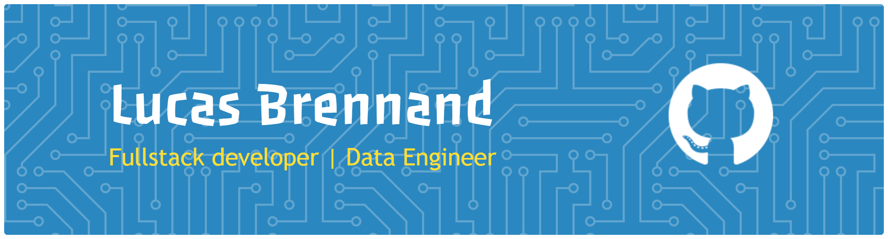

<div style="display: flex" align="center">
  
  
  [](https://git.io/typing-svg)
</div>

##

<a href="https://github.com/LucasBrennand?tab=repositories&sort=stargazers">
  
</a>
<a href="https://github.com/LucasBrennand?tab=followers">
  
</a>
<a href="https://komarev.com/ghpvc/?username=LucasBrennand">
  
</a>

*I'm a Fullstack Developer!*

##

<details open> 
  <summary><h2>About Me</h2></summary>
  
<table>
<tr>
<td width="50%" valign="top">


</td>
<td width="50%" valign="top">

```js
const lucas = {
education: [
degree: "Bachelors",
name: "Computer Science",
univeristy: "Catholic University of Pernambuco (UNICAP)"
],
expertise: [
  "FullStack",
  "Data Engineering",
  "Data Science",
  "Machine Learning",
  "AI"
]
languages: {
  pt: "Native",
  en: "Native",
  }
};
```

</td>
</tr>
</table>

</details>

##
<h3>Things I code with</h3>
<p>
  
  
  
  
  
  
  
  
  
  
   
  
  
  
  
  
  
  
  
  
  
  
  
  
  
  
  
</p>


<div style="display: inline_block"><br>
  ✨ My page: <br /> <br />
  <a href="https://lucasbrennand.github.io/Portfolio-2024.2/" target="_blank"> 
 </div>

<h2>Want to get in touch?</h2>
<div style="display: inline_block"><br>
    <a href="mailto:lucasbrennand.barbosa@gmail.com " target="_blank"> 
    <a href="https://wa.me/5581995697350" target="_blank"> 
    <a href="https://www.linkedin.com/in/lucas-brennand-9121b2205" target="_blank">
    <a href="http://discordapp.com/users/%C6%A8%C9%92%C9%94%CF%85%E2%85%83#4335" target=_blank>
    <a href="https://www.instagram.com/lucasbbrennand/" target="blank">
</div>
<!--
**lucas2020109662/lucas2020109662** is a ✨ _special_ ✨ repository because its `README.md` (this file) appears on your GitHub profile.

Here are some ideas to get you started:

- 🔭 I’m currently working on ...
- 🌱 I’m currently learning ...
- 👯 I’m looking to collaborate on ...
- 🤔 I’m looking for help with ...
- 💬 Ask me about ...
- 📫 How to reach me: ...
- 😄 Pronouns: ...
- ⚡ Fun fact: ...
-->
